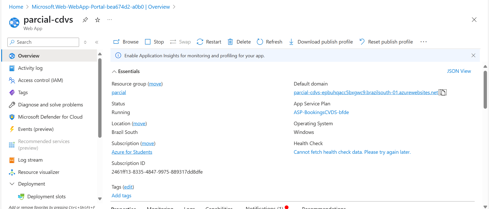
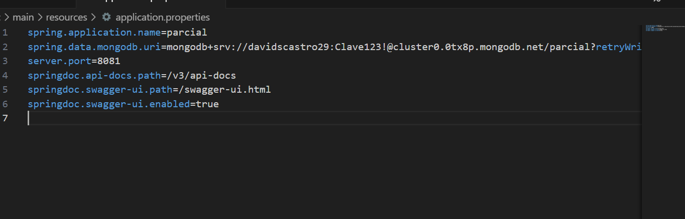

# parcial
Nombre: David Santiago Castro 

1) Creamos el repositorio con lo minimo
2) Desplegamos el back en azure con el siguiente link
parcial-cdvs-epbuhqacc5bxgwc9.brazilsouth-01.azurewebsites.net

3) Realizamos la conexion con mongo Db

4) Realizamos el back
